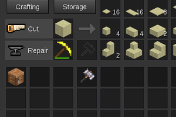

## Work Bench

### Description:

A work bench for [Minetest][], forked from the [xdecor mod](https://github.com/kilbith/xdecor).

It can cut up to 12 shapes, repair your tools, craft items and store.

### Licensing:

- Code: [LGPL v3.0](LICENSE.txt)
- Textures by Gambit: CC0

### Links:

- [Git repo](https://github.com/AntumMT/mod-workbench)
- [Changelog](changelog.txt)
- [TODO](TODO.txt)

[Minetest]: http://minetest.net/
